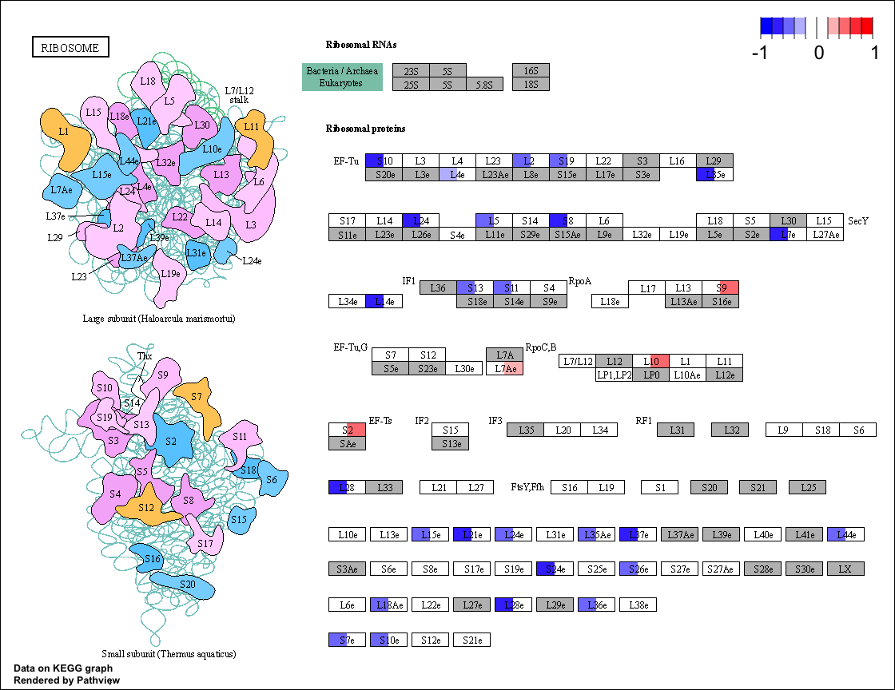

**Abstract**

**Introduction**

Anthozoans are a class within the Cnidarians that includes corals,
anemones and their relatives. In contrast to insect immune responses,
very little is known about the immune response of this key group of
invertebrates. Initial characterizations of immune related genes in
cnidarians using genome and EST scans indicated that they possess the
Toll/TLR pathway, complement C3, membrane attack complex/perforin
domains, and other components of innate immunity once thought to have
evolved much later [1]. However, very little data existed indicating
whether or not these immune pathways were actually used in cnidarians to
mount a response against pathogens. A number of groups have since used
RNA-seq to produce some of the first profiles of anthozoan innate
immunity. Weiss et al. (2013) studied the response of *Acropora
millepora* to the bacterial cell wall derivative muramyl dipeptide
(MDP), finding up-regulation of GTPases of immunity associated proteins
(GiMAPs) [2]. GiMAPS were formerly primarily associated with vertebrates
and plants [3] [4]. Vidal-Dupiol et al. (2014) compared the
transcriptomic responses of *Pocillopora damicornis* to thermal stress
and *Vibrio coralliilyticus* Infection and found overall down-regulation
of immune processes in response to thermal stress combined with
thermally-induced virulence factors in *V. coralliilyticus.* Affected
pathways included Toll-like, complement, prophenoloxidase, and the
leukotriene cascade. Libro et al. (2013) compared the immune response of
healthy and diseased corals using RNA-seq, finding up-regulation of
C-type lectins, ROS production, arachidonic acid metabolism, and allene
oxide production in diseased corals [5]. Up-regulation of C-type lectins
and ROS production are hallmarks of phagocytosis, and the metabolism of
arachidonic acid via the allene oxide pathway has been linked to
eicosanoid synthesis in wounded corals [6]. Interestingly, they did not
identify strong up-regulation of genes associated with the classic
innate immune pathways such as Toll-like receptor pathway or
Prophenoloxidase pathway.

Vollmer and Kline (2008) identified staghorn coral genotypes with
natural resistance to white-band disease [7], and Libro and Vollmer
(2016) compared gene expression patterns between these two genotypes
using RNA-seq. They found that WBD-resistant corals exhibited
up-regulation of NOD-like receptors (NLRs) and genes associated with RNA
interference and down-regulation of heat-shock proteins [8]. In the
context of immunity, RNAi is generally associated with the response to
viral infection, but experiments identifying bacterial pathogens as the
causative agent of WBD [9] make an antiviral role for RNAi in WBD
resistance seem unlikely. The up-regulation of Argonaute and other
RNAi-related genes may be related to miRNA-directed gene silencing in a
manner similar to the regulation of auxin production associated with
increased resistance to bacterial pathogens in plants [10]. While these
RNA-Seq analyses have begun to confirm expression of the extensive
immune repertoire found in anthozoan genomes and add to the growing
consensus regarding the ancient origins of immunity [11] [12] [13],
detailed pathway analyses are needed to move toward the
well-characterized pathways of model organisms like *Drosophila*.

Reef-building corals and other anthozoans like *Aiptasia* are well known
for their symbiotic relationship with the dinoflagellate *Symbiodinium*
(also called zooxanthellae or “zoox”). The symbionts live in vacuoles
inside the endodermis of the coral and give the host up to 95% of its
energy as translocated polysaccharides. Symbiosis requires clear
communication between the host and symbiont. During the establishment of
symbiosis, the host must be able to recognize symbionts, engulf them in
phagosomes, and shield these phagosomes from destruction [14]. This
suggests a clear link between symbioses and immunity wherein symbionts
evade the immune response. Arrest of phagosomal maturation by Rab
GTPases [15] and suppression of immune responses by transforming growth
factor beta (TGFB) have been identified as potential mechanisms by which
symbionts are shielded from destruction by the immune system [16]. Once
symbiosis is established, the host must regulate the growth of the
symbionts and eject dead or dying symbionts [17]. Regulation of
nutrients has been identified as one mechanism by which the host can
prevent overgrowth of the dinoflagellates [18]. For corals and other
symbiotic anemones, we know very little about how the relationship is
maintained. Instead, we know a great deal about the breakdown in the
symbiosis – known as bleaching – when the symbionts to be degraded or
expelled by the coral host under stressful conditions like increased
temperature.

*Aiptasia* has become a model for studying symbiosis in anthozoans
because it is a hardy animal that can be made aposymbiotic
experimentally by exposing it to cold and heat stress as well as by
treating it with compounds like menthol. Lehnert et al*.* (2014) used
RNA-seq in a transcriptomic comparison of symbiotic and aposymbiotic
anemones and found about 900 differentially expressed genes involved in
metabolite transport, lipid metabolism, amino acid metabolism, and
potentially host tolerance of dinoflagellates [19]. Among those with a
potentially tolerogenic role in symbiotic anemones the comparison
revealed a general down-regulation of pro-inflammatory genes and
up-regulation of anti-inflammatory genes [20]. Down-regulated
pro-inflammatory genes included those involved in nitric oxide
production and up-regulated anti-inflammatory genes included scavenger
receptor B class member 1 (SRB1) [21]. SRB1 is of interest as a
potential tolerogenic because of its heavy up-regulation in symbiotic
anemones as [22] well as its previously identified role in facilitating
*Plasmodium* infection [23]. Detournay et al. (2012) performed an LPS
exposure experiment using nitric oxide (NO) as a measure of immune
activation to determine the role of TGFB in symbiosis [24]. They found
that TGFB plays a tolerogenic role in the establishment and maintenance
of symbiosis in *A. pallida*. Introduction of exogenous human TGFB
reduced immune activation and partially blocked thermally-induced
bleaching while Introduction of anti-TGFB blocked this pathway and
prevented the establishment of symbiosis [25].

The immune response of *Aiptasia* can provide insight into the
evolutionary origin of the innate immune response as well as the
mechanism behind the breakdown of symbiosis that leads to bleaching in
corals. Obtaining 95% of their energy from the glucose produced by
symbionts, *Aiptasia* must be able to defend against pathogens while
tolerating algal symbionts in endodermal vacuoles. Immune suppression,
measured by relative levels of nitric oxide (NO) production, has been
demonstrated in symbiotic versus aposymbiotic anemones. Specific genes
have been tested for their role in this immune suppression [26], and
transcriptome-wide comparisons have been made between symbiotic and
aposymbiotic anemones [27]. Lehnert et al. (2012) compared the
transcriptomes of symbiotic anemones to aposymbiotic anemones bleached
by a combination of cold shock and the photosynthesis inhibitor Diuron
[28]. This comparison did not involve any immune challenge. It was
strictly a comparison of un-challenged symbiotic to un-challenged
aposymbiotic. This comparison was useful for identifying the whole range
of genes involved in symbiosis, including metabolite transport [29], but
without an immune challenge it did not test for differences in immune
response between symbiotic and aposymbiotic anemones. To-date there has
not been a transcriptome-wide comparison of the response to immune
challenge in aposymbiotic versus aposymbiotic anemones. Detournay et
al*.* (2012) tested TGFB for its potential tolerogenic role in symbiosis
by measuring the effect of human TGFB and anti-TGFB on NO production,
establishment of symbiosis, and bleaching. They found strong evidence of
a tolerogenic role. This type of focused analysis on specific genes will
be needed to fully characterize pathways, but additional targets need to
be identified.

To further characterize the interactions between immunity, inflammation,
and symbiosis, we used RNA-Seq to compare of the symbiotic and
aposymbiotic response of *Aiptasia* to the pathogen *Vibrio
coralliilyticus*. We chose menthol-bleaching as the method of producing
aposymbiotic anemones because this method has a lower mortality rate and
produces generally healthier anemones, and because the likely mechanism
of menthol bleaching is activation of autophagic digestion of
Symbiodinium cells (symbiophagy) as part of host innate immunity [30].
Aposymbiotic anemones were produced using a 24-hour menthol bleaching
cycle. Both symbiotic and aposymbiotic anemones were exposed to either
live Vibrio or control for a total of four treatment groups with six
biological replicates per group.

**Materials and Methods**

Aposymbiotic anemones were produced by exposure to 0.58 mM menthol/ASW
using a modified version of the protocol outlined by Wang, Chen, Tew,
Meng, and Chen (2012). Wild anemones were obtained from Carolina
Biological Supply. These anemones, collected off the coast of North
Carolina and kept in holding tanks [31], are the source from which the
widely-used cc7 clonal population was developed [32]. The wild anemones
are much larger than the available cc7 clones, and this facilitated
extraction of sufficient high-quality RNA without requiring pooling
within treatment groups.

Upon arrival the anemones were placed in six six-well plates and
maintained in the wells for a one-week acclimation phase. They were
exposed to a 12-hour day/night cycle with a light intensity of 70 umol
quanta m-2 s-1. To avoid contamination of the RNA
with any partially digested food the anemones were not fed during the
acclimation phase. To avoid any bias based on lighting intensity or
other positional effects, the four treatment groups were randomly
assigned to wells within six-well plates.

The menthol exposure was on a 48-hour cycle, with a 24-hour menthol
exposure followed by a 24-hour resting period in ASW. A total of 36
anemones were put through the bleaching cycle. During the bleaching
cycle, 18 anemones had water replaced with .58 mM menthol/FNSW, and 18
had water replaced with fresh FNSW. Six bleached and six unbleached
anemones were homogenized prior to the Vibrio/Control treatment to
determine the degree of bleaching. The degree of bleaching was measured
by homogenizing anemones in 1uL filtered seawater, counting zoox with a
hemocytometer, and normalizing by animal weight. After the 24-hour
resting period in FNSW, the remaining 24 anemones were divided into four
treatment groups:

|            | Live *Vibrio* | Sterile Seawater |
|------------|---------------|------------------|
| Bleached   | 6 anemones    | 6 anemones       |
| Unbleached | 6 anemones    | 6 anemones       |

The live *Vibrio* groups were inoculated at a concentration of
108 CFU ml-1 in FNSW. The *Vibrio* inoculate was
produced by centrifuging marine broth cultures, drawing off the broth,
and re-suspending the pellet in FNSW. The anemones were exposed to
either Vibrio or control for 24 hours, then immediately homogenized in
Tri-Reagent.

The anemones were homogenized using BioMasher mortar and pestle sets.
Each anemone was first homogenized in 900 uL Tri-Reagent, then the 900
uL was divided into three separate tubes to which an additional 600 uL
Tri-Reagent was added to ensure sufficient Tri-Reagent to completely
lyse the cells. RNA was isolated separately from each of the 72
homogenate tubes per the Tri-Reagent manufacturer’s protocol. The total
RNA was analyzed on an Agilent BioAnalyzer to obtain RIN scores.

For each of the 24 samples the RNA isolate with the highest RIN score
was selected to proceed to mRNA isolation and library preparation. mRNA
was isolated using the NEBNext® Poly(A) mRNA Magnetic
Isolation Module and Illumina libraries were produced using the
NEBNext® Ultra™ Directional RNA Library Prep Kit
for Illumina®.

Multiplexed paired-end libraries were sequenced on an Illumina HiSeq
2500 platform at the FAS Center for System Biology at Harvard
University. The reads were adapter and quality-trimmed using Trimmomatic
version 0.36 [33] using a 4-base sliding-window quality cutoff of 30
(Phred+33) and the TruSeq3 adapter sequence file (TruSeq3-PE.fa).
Transcript counts were quantified against the published Aiptasia
predicted coding sequences [34] using Salmon [35]. The transcript counts
were imported into DESeq2 [36] using tximport [37]. The
transcript-to-gene mapping and annotation file was created by aligning
predicted coding sequences to Swiss-Prot [38] using blastx [39].

To facilitate pathway-level analysis Swiss-Prot blastx results were
merged with the corresponding KEGG orthologs [40] using a custom Perl
script. BLAST hits were filtered using an e-value cutoff of
1e-10-5 and an alignment length of at least 50% of the target
protein. In cases where the filtered BLAST hits mapped to more than one
KEGG ortholog, the ortholog with the greatest number of matches was
selected.

\[1\] “quants/Aip02/quant.sf” “quants/Aip05/quant.sf”
“quants/Aip06/quant.sf” \[4\] “quants/Aip12/quant.sf”
“quants/Aip13/quant.sf” “quants/Aip14/quant.sf” \[7\]
“quants/Aip15/quant.sf” “quants/Aip17/quant.sf” “quants/Aip18/quant.sf”
\[10\] “quants/Aip19/quant.sf” “quants/Aip20/quant.sf”
“quants/Aip21/quant.sf” \[13\] “quants/Aip23/quant.sf”
“quants/Aip24/quant.sf” “quants/Aip25/quant.sf” \[16\]
“quants/Aip26/quant.sf” “quants/Aip28/quant.sf” “quants/Aip29/quant.sf”
\[19\] “quants/Aip30/quant.sf” “quants/Aip32/quant.sf”
“quants/Aip33/quant.sf” \[22\] “quants/Aip34/quant.sf”
“quants/Aip35/quant.sf” “quants/Aip36/quant.sf”

**Differential Expression Summary**

Figure 1 summarizes the differentially expressed genes for Vibrio,
Menthol, Vibrio:Menthol interaction, and all observed set combinations
of the three. The black bars indicate total differentially expressed
genes, and the blue bars indicate differentially expressed genes for
which a KEGG ortholog annotation was obtained.

**Figure 1**

**KEGG Pathway Enrichment Analysis** Enriched KEGG pathways were
identified using GAGE [41]. Table 1 lists pathways enriched for Vibrio
or Menthol, excluding pathways KEGG categorizes as human disease
specific.

<table>
<caption>
Enriched Pathways (GAGE)
</caption>
<thead>
<tr>
<th style="text-align:left;">
</th>
<th style="text-align:left;">
Category
</th>
<th style="text-align:left;">
Vibrio-p
</th>
<th style="text-align:left;">
Menthol-p
</th>
</tr>
</thead>
<tbody>
<tr>
<td style="text-align:left;">
ko04610 Complement and coagulation cascades
</td>
<td style="text-align:left;">
Immune system
</td>
<td style="text-align:left;">
2.99e-02
</td>
<td style="text-align:left;">
NA
</td>
</tr>
<tr>
<td style="text-align:left;">
ko04670 Leukocyte transendothelial migration
</td>
<td style="text-align:left;">
Immune system
</td>
<td style="text-align:left;">
3.29e-02
</td>
<td style="text-align:left;">
NA
</td>
</tr>
<tr>
<td style="text-align:left;">
ko04391 Hippo signaling pathway - fly
</td>
<td style="text-align:left;">
Signal transduction
</td>
<td style="text-align:left;">
4.78e-02
</td>
<td style="text-align:left;">
NA
</td>
</tr>
<tr>
<td style="text-align:left;">
ko04510 Focal adhesion
</td>
<td style="text-align:left;">
Cellular community - eukaryotes
</td>
<td style="text-align:left;">
3.15e-02
</td>
<td style="text-align:left;">
NA
</td>
</tr>
<tr>
<td style="text-align:left;">
ko04668 TNF signaling pathway
</td>
<td style="text-align:left;">
Signal transduction
</td>
<td style="text-align:left;">
2.31e-02
</td>
<td style="text-align:left;">
NA
</td>
</tr>
<tr>
<td style="text-align:left;">
ko04115 p53 signaling pathway
</td>
<td style="text-align:left;">
Cell growth and death
</td>
<td style="text-align:left;">
3.29e-02
</td>
<td style="text-align:left;">
NA
</td>
</tr>
<tr>
<td style="text-align:left;">
ko04620 Toll-like receptor signaling pathway
</td>
<td style="text-align:left;">
Immune system
</td>
<td style="text-align:left;">
1.76e-02
</td>
<td style="text-align:left;">
NA
</td>
</tr>
<tr>
<td style="text-align:left;">
ko04810 Regulation of actin cytoskeleton
</td>
<td style="text-align:left;">
Cell motility
</td>
<td style="text-align:left;">
4.42e-02
</td>
<td style="text-align:left;">
NA
</td>
</tr>
<tr>
<td style="text-align:left;">
ko04910 Insulin signaling pathway
</td>
<td style="text-align:left;">
Endocrine system
</td>
<td style="text-align:left;">
7.26e-03
</td>
<td style="text-align:left;">
NA
</td>
</tr>
<tr>
<td style="text-align:left;">
ko04151 PI3K-Akt signaling pathway
</td>
<td style="text-align:left;">
Signal transduction
</td>
<td style="text-align:left;">
3.92e-02
</td>
<td style="text-align:left;">
NA
</td>
</tr>
<tr>
<td style="text-align:left;">
ko04380 Osteoclast differentiation
</td>
<td style="text-align:left;">
Development and regeneration
</td>
<td style="text-align:left;">
1.32e-02
</td>
<td style="text-align:left;">
NA
</td>
</tr>
<tr>
<td style="text-align:left;">
ko04915 Estrogen signaling pathway
</td>
<td style="text-align:left;">
Endocrine system
</td>
<td style="text-align:left;">
4.03e-03
</td>
<td style="text-align:left;">
NA
</td>
</tr>
<tr>
<td style="text-align:left;">
ko04722 Neurotrophin signaling pathway
</td>
<td style="text-align:left;">
Nervous system
</td>
<td style="text-align:left;">
2.73e-03
</td>
<td style="text-align:left;">
NA
</td>
</tr>
<tr>
<td style="text-align:left;">
ko04010 MAPK signaling pathway
</td>
<td style="text-align:left;">
Signal transduction
</td>
<td style="text-align:left;">
4.41e-02
</td>
<td style="text-align:left;">
NA
</td>
</tr>
<tr>
<td style="text-align:left;">
ko04660 T cell receptor signaling pathway
</td>
<td style="text-align:left;">
Immune system
</td>
<td style="text-align:left;">
2.99e-02
</td>
<td style="text-align:left;">
NA
</td>
</tr>
<tr>
<td style="text-align:left;">
ko04728 Dopaminergic synapse
</td>
<td style="text-align:left;">
Nervous system
</td>
<td style="text-align:left;">
2.99e-02
</td>
<td style="text-align:left;">
NA
</td>
</tr>
<tr>
<td style="text-align:left;">
ko04145 Phagosome
</td>
<td style="text-align:left;">
Transport and catabolism
</td>
<td style="text-align:left;">
3.36e-04
</td>
<td style="text-align:left;">
2.01e-02
</td>
</tr>
<tr>
<td style="text-align:left;">
ko04142 Lysosome
</td>
<td style="text-align:left;">
Transport and catabolism
</td>
<td style="text-align:left;">
6.61e-04
</td>
<td style="text-align:left;">
4.95e-02
</td>
</tr>
<tr>
<td style="text-align:left;">
ko03010 Ribosome
</td>
<td style="text-align:left;">
Translation
</td>
<td style="text-align:left;">
3.24e-34
</td>
<td style="text-align:left;">
7.08e-26
</td>
</tr>
<tr>
<td style="text-align:left;">
ko04210 Apoptosis
</td>
<td style="text-align:left;">
Cell growth and death
</td>
<td style="text-align:left;">
4.18e-02
</td>
<td style="text-align:left;">
NA
</td>
</tr>
<tr>
<td style="text-align:left;">
ko04626 Plant-pathogen interaction
</td>
<td style="text-align:left;">
Environmental adaptation
</td>
<td style="text-align:left;">
4.03e-03
</td>
<td style="text-align:left;">
2.82e-02
</td>
</tr>
<tr>
<td style="text-align:left;">
ko04912 GnRH signaling pathway
</td>
<td style="text-align:left;">
Endocrine system
</td>
<td style="text-align:left;">
5.49e-03
</td>
<td style="text-align:left;">
NA
</td>
</tr>
<tr>
<td style="text-align:left;">
ko04621 NOD-like receptor signaling pathway
</td>
<td style="text-align:left;">
Immune system
</td>
<td style="text-align:left;">
3.29e-02
</td>
<td style="text-align:left;">
NA
</td>
</tr>
</tbody>
</table>

**Differentially Expressed Genes by Pathway**

Table 2 lists the pathways and the number of differentially expressed
genes identified by DESeq2. The counts are separated into genes
up-regulated for *Vibrio*, genes down-regulated for *Vibrio*, genes
up-regulated for menthol, and genes down-regulated for menthol. A
pathway was considered up for a condition if the up-regulated count
exceeded the down-regulated count by more than 3. A pathway was
considered down for a condition if the down-regulated count exceeded the
up-regulated count by more than 3.

<table>
<caption>
DE Genes by Pathway (DESeq2)
</caption>
<thead>
<tr>
<th style="text-align:left;">
</th>
<th style="text-align:right;">
Annot
</th>
<th style="text-align:right;">
Up Vibrio
</th>
<th style="text-align:right;">
Down Vibrio
</th>
<th style="text-align:right;">
Up Menthol
</th>
<th style="text-align:right;">
Down Menthol
</th>
<th style="text-align:left;">
Group
</th>
</tr>
</thead>
<tbody>
<tr>
<td style="text-align:left;">
ko04391 Hippo signaling pathway - fly
</td>
<td style="text-align:right;">
14
</td>
<td style="text-align:right;">
5
</td>
<td style="text-align:right;">
1
</td>
<td style="text-align:right;">
1
</td>
<td style="text-align:right;">
1
</td>
<td style="text-align:left;">
Up Vibrio
</td>
</tr>
<tr>
<td style="text-align:left;">
ko04668 TNF signaling pathway
</td>
<td style="text-align:right;">
23
</td>
<td style="text-align:right;">
11
</td>
<td style="text-align:right;">
0
</td>
<td style="text-align:right;">
3
</td>
<td style="text-align:right;">
0
</td>
<td style="text-align:left;">
Up Vibrio
</td>
</tr>
<tr>
<td style="text-align:left;">
ko04620 Toll-like receptor signaling pathway
</td>
<td style="text-align:right;">
15
</td>
<td style="text-align:right;">
6
</td>
<td style="text-align:right;">
0
</td>
<td style="text-align:right;">
1
</td>
<td style="text-align:right;">
0
</td>
<td style="text-align:left;">
Up Vibrio
</td>
</tr>
<tr>
<td style="text-align:left;">
ko04910 Insulin signaling pathway
</td>
<td style="text-align:right;">
35
</td>
<td style="text-align:right;">
9
</td>
<td style="text-align:right;">
4
</td>
<td style="text-align:right;">
1
</td>
<td style="text-align:right;">
2
</td>
<td style="text-align:left;">
Up Vibrio
</td>
</tr>
<tr>
<td style="text-align:left;">
ko04380 Osteoclast differentiation
</td>
<td style="text-align:right;">
23
</td>
<td style="text-align:right;">
9
</td>
<td style="text-align:right;">
1
</td>
<td style="text-align:right;">
1
</td>
<td style="text-align:right;">
0
</td>
<td style="text-align:left;">
Up Vibrio
</td>
</tr>
<tr>
<td style="text-align:left;">
ko04915 Estrogen signaling pathway
</td>
<td style="text-align:right;">
24
</td>
<td style="text-align:right;">
7
</td>
<td style="text-align:right;">
3
</td>
<td style="text-align:right;">
0
</td>
<td style="text-align:right;">
1
</td>
<td style="text-align:left;">
Up Vibrio
</td>
</tr>
<tr>
<td style="text-align:left;">
ko04722 Neurotrophin signaling pathway
</td>
<td style="text-align:right;">
27
</td>
<td style="text-align:right;">
11
</td>
<td style="text-align:right;">
0
</td>
<td style="text-align:right;">
3
</td>
<td style="text-align:right;">
0
</td>
<td style="text-align:left;">
Up Vibrio
</td>
</tr>
<tr>
<td style="text-align:left;">
ko04010 MAPK signaling pathway
</td>
<td style="text-align:right;">
45
</td>
<td style="text-align:right;">
10
</td>
<td style="text-align:right;">
4
</td>
<td style="text-align:right;">
3
</td>
<td style="text-align:right;">
2
</td>
<td style="text-align:left;">
Up Vibrio
</td>
</tr>
<tr>
<td style="text-align:left;">
ko04660 T cell receptor signaling pathway
</td>
<td style="text-align:right;">
19
</td>
<td style="text-align:right;">
6
</td>
<td style="text-align:right;">
1
</td>
<td style="text-align:right;">
0
</td>
<td style="text-align:right;">
0
</td>
<td style="text-align:left;">
Up Vibrio
</td>
</tr>
<tr>
<td style="text-align:left;">
ko04912 GnRH signaling pathway
</td>
<td style="text-align:right;">
17
</td>
<td style="text-align:right;">
4
</td>
<td style="text-align:right;">
0
</td>
<td style="text-align:right;">
0
</td>
<td style="text-align:right;">
0
</td>
<td style="text-align:left;">
Up Vibrio
</td>
</tr>
<tr>
<td style="text-align:left;">
ko04610 Complement and coagulation cascades
</td>
<td style="text-align:right;">
10
</td>
<td style="text-align:right;">
7
</td>
<td style="text-align:right;">
0
</td>
<td style="text-align:right;">
4
</td>
<td style="text-align:right;">
0
</td>
<td style="text-align:left;">
Up Both
</td>
</tr>
<tr>
<td style="text-align:left;">
ko04670 Leukocyte transendothelial migration
</td>
<td style="text-align:right;">
26
</td>
<td style="text-align:right;">
11
</td>
<td style="text-align:right;">
5
</td>
<td style="text-align:right;">
4
</td>
<td style="text-align:right;">
0
</td>
<td style="text-align:left;">
Up Both
</td>
</tr>
<tr>
<td style="text-align:left;">
ko04510 Focal adhesion
</td>
<td style="text-align:right;">
38
</td>
<td style="text-align:right;">
12
</td>
<td style="text-align:right;">
6
</td>
<td style="text-align:right;">
6
</td>
<td style="text-align:right;">
0
</td>
<td style="text-align:left;">
Up Both
</td>
</tr>
<tr>
<td style="text-align:left;">
ko04151 PI3K-Akt signaling pathway
</td>
<td style="text-align:right;">
56
</td>
<td style="text-align:right;">
18
</td>
<td style="text-align:right;">
5
</td>
<td style="text-align:right;">
6
</td>
<td style="text-align:right;">
2
</td>
<td style="text-align:left;">
Up Both
</td>
</tr>
<tr>
<td style="text-align:left;">
ko04145 Phagosome
</td>
<td style="text-align:right;">
39
</td>
<td style="text-align:right;">
9
</td>
<td style="text-align:right;">
1
</td>
<td style="text-align:right;">
6
</td>
<td style="text-align:right;">
2
</td>
<td style="text-align:left;">
Up Both
</td>
</tr>
<tr>
<td style="text-align:left;">
ko04115 p53 signaling pathway
</td>
<td style="text-align:right;">
19
</td>
<td style="text-align:right;">
4
</td>
<td style="text-align:right;">
3
</td>
<td style="text-align:right;">
4
</td>
<td style="text-align:right;">
1
</td>
<td style="text-align:left;">
Mixed
</td>
</tr>
<tr>
<td style="text-align:left;">
ko04810 Regulation of actin cytoskeleton
</td>
<td style="text-align:right;">
43
</td>
<td style="text-align:right;">
8
</td>
<td style="text-align:right;">
9
</td>
<td style="text-align:right;">
2
</td>
<td style="text-align:right;">
1
</td>
<td style="text-align:left;">
Mixed
</td>
</tr>
<tr>
<td style="text-align:left;">
ko04728 Dopaminergic synapse
</td>
<td style="text-align:right;">
25
</td>
<td style="text-align:right;">
5
</td>
<td style="text-align:right;">
3
</td>
<td style="text-align:right;">
0
</td>
<td style="text-align:right;">
1
</td>
<td style="text-align:left;">
Mixed
</td>
</tr>
<tr>
<td style="text-align:left;">
ko04142 Lysosome
</td>
<td style="text-align:right;">
51
</td>
<td style="text-align:right;">
8
</td>
<td style="text-align:right;">
7
</td>
<td style="text-align:right;">
5
</td>
<td style="text-align:right;">
2
</td>
<td style="text-align:left;">
Mixed
</td>
</tr>
<tr>
<td style="text-align:left;">
ko04210 Apoptosis
</td>
<td style="text-align:right;">
28
</td>
<td style="text-align:right;">
6
</td>
<td style="text-align:right;">
3
</td>
<td style="text-align:right;">
1
</td>
<td style="text-align:right;">
0
</td>
<td style="text-align:left;">
Mixed
</td>
</tr>
<tr>
<td style="text-align:left;">
ko04626 Plant-pathogen interaction
</td>
<td style="text-align:right;">
11
</td>
<td style="text-align:right;">
1
</td>
<td style="text-align:right;">
2
</td>
<td style="text-align:right;">
0
</td>
<td style="text-align:right;">
1
</td>
<td style="text-align:left;">
Mixed
</td>
</tr>
<tr>
<td style="text-align:left;">
ko04621 NOD-like receptor signaling pathway
</td>
<td style="text-align:right;">
38
</td>
<td style="text-align:right;">
3
</td>
<td style="text-align:right;">
0
</td>
<td style="text-align:right;">
0
</td>
<td style="text-align:right;">
1
</td>
<td style="text-align:left;">
Mixed
</td>
</tr>
<tr>
<td style="text-align:left;">
ko03010 Ribosome
</td>
<td style="text-align:right;">
87
</td>
<td style="text-align:right;">
0
</td>
<td style="text-align:right;">
26
</td>
<td style="text-align:right;">
4
</td>
<td style="text-align:right;">
0
</td>
<td style="text-align:left;">
Down Vibrio, Up Menthol
</td>
</tr>
</tbody>
</table>
<table>
<thead>
<tr>
<th style="text-align:left;">
</th>
<th style="text-align:left;">
VuPct
</th>
<th style="text-align:left;">
VdPct
</th>
<th style="text-align:left;">
MuPct
</th>
<th style="text-align:left;">
MdPct
</th>
<th style="text-align:left;">
group
</th>
</tr>
</thead>
<tbody>
<tr>
<td style="text-align:left;">
ko04626 Plant-pathogen interaction
</td>
<td style="text-align:left;">
9.1
</td>
<td style="text-align:left;">
18.2
</td>
<td style="text-align:left;">
0.0
</td>
<td style="text-align:left;">
9.1
</td>
<td style="text-align:left;">
Down Vibrio Down Menthol
</td>
</tr>
<tr>
<td style="text-align:left;">
ko04810 Regulation of actin cytoskeleton
</td>
<td style="text-align:left;">
18.6
</td>
<td style="text-align:left;">
20.9
</td>
<td style="text-align:left;">
4.7
</td>
<td style="text-align:left;">
2.3
</td>
<td style="text-align:left;">
Down Vibrio Up Menthol
</td>
</tr>
<tr>
<td style="text-align:left;">
ko03010 Ribosome
</td>
<td style="text-align:left;">
0.0
</td>
<td style="text-align:left;">
29.9
</td>
<td style="text-align:left;">
4.6
</td>
<td style="text-align:left;">
0.0
</td>
<td style="text-align:left;">
Down Vibrio Up Menthol
</td>
</tr>
<tr>
<td style="text-align:left;">
ko04610 Complement and coagulation cascades
</td>
<td style="text-align:left;">
70.0
</td>
<td style="text-align:left;">
0.0
</td>
<td style="text-align:left;">
40.0
</td>
<td style="text-align:left;">
0.0
</td>
<td style="text-align:left;">
Up Both
</td>
</tr>
<tr>
<td style="text-align:left;">
ko04670 Leukocyte transendothelial migration
</td>
<td style="text-align:left;">
42.3
</td>
<td style="text-align:left;">
19.2
</td>
<td style="text-align:left;">
15.4
</td>
<td style="text-align:left;">
0.0
</td>
<td style="text-align:left;">
Up Both
</td>
</tr>
<tr>
<td style="text-align:left;">
ko04510 Focal adhesion
</td>
<td style="text-align:left;">
31.6
</td>
<td style="text-align:left;">
15.8
</td>
<td style="text-align:left;">
15.8
</td>
<td style="text-align:left;">
0.0
</td>
<td style="text-align:left;">
Up Both
</td>
</tr>
<tr>
<td style="text-align:left;">
ko04668 TNF signaling pathway
</td>
<td style="text-align:left;">
47.8
</td>
<td style="text-align:left;">
0.0
</td>
<td style="text-align:left;">
13.0
</td>
<td style="text-align:left;">
0.0
</td>
<td style="text-align:left;">
Up Both
</td>
</tr>
<tr>
<td style="text-align:left;">
ko04115 p53 signaling pathway
</td>
<td style="text-align:left;">
21.1
</td>
<td style="text-align:left;">
15.8
</td>
<td style="text-align:left;">
21.1
</td>
<td style="text-align:left;">
5.3
</td>
<td style="text-align:left;">
Up Both
</td>
</tr>
<tr>
<td style="text-align:left;">
ko04620 Toll-like receptor signaling pathway
</td>
<td style="text-align:left;">
40.0
</td>
<td style="text-align:left;">
0.0
</td>
<td style="text-align:left;">
6.7
</td>
<td style="text-align:left;">
0.0
</td>
<td style="text-align:left;">
Up Both
</td>
</tr>
<tr>
<td style="text-align:left;">
ko04151 PI3K-Akt signaling pathway
</td>
<td style="text-align:left;">
32.1
</td>
<td style="text-align:left;">
8.9
</td>
<td style="text-align:left;">
10.7
</td>
<td style="text-align:left;">
3.6
</td>
<td style="text-align:left;">
Up Both
</td>
</tr>
<tr>
<td style="text-align:left;">
ko04380 Osteoclast differentiation
</td>
<td style="text-align:left;">
39.1
</td>
<td style="text-align:left;">
4.3
</td>
<td style="text-align:left;">
4.3
</td>
<td style="text-align:left;">
0.0
</td>
<td style="text-align:left;">
Up Both
</td>
</tr>
<tr>
<td style="text-align:left;">
ko04722 Neurotrophin signaling pathway
</td>
<td style="text-align:left;">
40.7
</td>
<td style="text-align:left;">
0.0
</td>
<td style="text-align:left;">
11.1
</td>
<td style="text-align:left;">
0.0
</td>
<td style="text-align:left;">
Up Both
</td>
</tr>
<tr>
<td style="text-align:left;">
ko04010 MAPK signaling pathway
</td>
<td style="text-align:left;">
22.2
</td>
<td style="text-align:left;">
8.9
</td>
<td style="text-align:left;">
6.7
</td>
<td style="text-align:left;">
4.4
</td>
<td style="text-align:left;">
Up Both
</td>
</tr>
<tr>
<td style="text-align:left;">
ko04145 Phagosome
</td>
<td style="text-align:left;">
23.1
</td>
<td style="text-align:left;">
2.6
</td>
<td style="text-align:left;">
15.4
</td>
<td style="text-align:left;">
5.1
</td>
<td style="text-align:left;">
Up Both
</td>
</tr>
<tr>
<td style="text-align:left;">
ko04142 Lysosome
</td>
<td style="text-align:left;">
15.7
</td>
<td style="text-align:left;">
13.7
</td>
<td style="text-align:left;">
9.8
</td>
<td style="text-align:left;">
3.9
</td>
<td style="text-align:left;">
Up Both
</td>
</tr>
<tr>
<td style="text-align:left;">
ko04210 Apoptosis
</td>
<td style="text-align:left;">
21.4
</td>
<td style="text-align:left;">
10.7
</td>
<td style="text-align:left;">
3.6
</td>
<td style="text-align:left;">
0.0
</td>
<td style="text-align:left;">
Up Both
</td>
</tr>
<tr>
<td style="text-align:left;">
ko04391 Hippo signaling pathway - fly
</td>
<td style="text-align:left;">
35.7
</td>
<td style="text-align:left;">
7.1
</td>
<td style="text-align:left;">
7.1
</td>
<td style="text-align:left;">
7.1
</td>
<td style="text-align:left;">
Up Vibrio
</td>
</tr>
<tr>
<td style="text-align:left;">
ko04660 T cell receptor signaling pathway
</td>
<td style="text-align:left;">
31.6
</td>
<td style="text-align:left;">
5.3
</td>
<td style="text-align:left;">
0.0
</td>
<td style="text-align:left;">
0.0
</td>
<td style="text-align:left;">
Up Vibrio
</td>
</tr>
<tr>
<td style="text-align:left;">
ko04912 GnRH signaling pathway
</td>
<td style="text-align:left;">
23.5
</td>
<td style="text-align:left;">
0.0
</td>
<td style="text-align:left;">
0.0
</td>
<td style="text-align:left;">
0.0
</td>
<td style="text-align:left;">
Up Vibrio
</td>
</tr>
<tr>
<td style="text-align:left;">
ko04910 Insulin signaling pathway
</td>
<td style="text-align:left;">
25.7
</td>
<td style="text-align:left;">
11.4
</td>
<td style="text-align:left;">
2.9
</td>
<td style="text-align:left;">
5.7
</td>
<td style="text-align:left;">
Up Vibrio Down Menthol
</td>
</tr>
<tr>
<td style="text-align:left;">
ko04915 Estrogen signaling pathway
</td>
<td style="text-align:left;">
29.2
</td>
<td style="text-align:left;">
12.5
</td>
<td style="text-align:left;">
0.0
</td>
<td style="text-align:left;">
4.2
</td>
<td style="text-align:left;">
Up Vibrio Down Menthol
</td>
</tr>
<tr>
<td style="text-align:left;">
ko04728 Dopaminergic synapse
</td>
<td style="text-align:left;">
20.0
</td>
<td style="text-align:left;">
12.0
</td>
<td style="text-align:left;">
0.0
</td>
<td style="text-align:left;">
4.0
</td>
<td style="text-align:left;">
Up Vibrio Down Menthol
</td>
</tr>
<tr>
<td style="text-align:left;">
ko04621 NOD-like receptor signaling pathway
</td>
<td style="text-align:left;">
7.9
</td>
<td style="text-align:left;">
0.0
</td>
<td style="text-align:left;">
0.0
</td>
<td style="text-align:left;">
2.6
</td>
<td style="text-align:left;">
Up Vibrio Down Menthol
</td>
</tr>
</tbody>
</table>

                  
   

**References**

[1] Miller DJ, Hemmrich G, Ball EE, et al. The innate immune repertoire
in Cnidaria - ancestral complexity and stochastic gene loss. *Genome
Biology*. 2007;8(4):R59. <doi:10.1186/gb-2007-8-4-r59>.

[2] Weiss, Y., Forêt, S., Hayward, D. C., Ainsworth, T., King, R., Ball,
E. E., & Miller, D. J. (2013). The acute transcriptional response of the
coral *Acropora millepora* to immune challenge: expression of GiMAP/IAN
genes links the innate immune responses of corals with those of mammals
and plants. *BMC Genomics*, *14*, 400.
<http://doi.org/10.1186/1471-2164-14-400>

[3] Liu, C., Wang, T., Zhang, W., & Li, X. (2008). Computational
identification and analysis of immune-associated nucleotide gene family
in Arabidopsis thaliana. *Journal of Plant Physiology*, *165*(7),
777–787. <http://doi.org/10.1016/j.jplph.2007.06.002>

[4] Wang, Z., & Li, X. (2009). IAN/GIMAPs are conserved and novel
regulators in vertebrates and angiosperm plants. *Plant Signaling &
Behavior*, *4*(3), 165–167.

[5] Libro S, Kaluziak ST, Vollmer SV. RNA-seq Profiles of Immune Related
Genes in the Staghorn Coral *Acropora cervicornis* Infected with White
Band Disease. Söderhäll K, ed. *PLoS ONE*. 2013;8(11):e81821.
<doi:10.1371/journal.pone.0081821>.

[6] Lõhelaid H, Teder T, Tõldsepp K, Ekins M, Samel N. Up-Regulated
Expression of *AOS-LOXa* and Increased Eicosanoid Synthesis in Response
to Coral Wounding. Campbell DA, ed. *PLoS ONE*. 2014;9(2):e89215.
<doi:10.1371/journal.pone.0089215>.

[7] Vollmer SV, Kline DI. Natural Disease Resistance in Threatened
Staghorn Corals. Bruno JF, ed. *PLoS ONE*. 2008;3(11):e3718.
<doi:10.1371/journal.pone.0003718>.

[8] Libro S, Vollmer SV. Genetic Signature of Resistance to White Band
Disease in the Caribbean Staghorn Coral *Acropora cervicornis*. Melzner
F, ed. *PLoS ONE*. 2016;11(1):e0146636.
<doi:10.1371/journal.pone.0146636>.

[9] Kline DI, Vollmer SV. White Band Disease (type I) of Endangered
Caribbean Acroporid Corals is Caused by Pathogenic Bacteria. *Scientific
Reports*. 2011;1:7. <doi:10.1038/srep00007>.

[10] Li Y, Zhang Q, Zhang J, Wu L, Qi Y, Zhou J-M. Identification of
MicroRNAs Involved in Pathogen-Associated Molecular Pattern-Triggered
Plant Innate Immunity. *Plant Physiology*. 2010;152(4):2222-2231.
<doi:10.1104/pp.109.151803>.

[11] Zhu, Y., Thangamani, S., Ho, B., & Ding, J. L. (2005). The ancient
origin of the complement system. *The EMBO Journal*, *24*(2), 382–394.
<http://doi.org/10.1038/sj.emboj.7600533>

[12] Dishaw, L. J., Smith, S. L., & Bigger, C. H. (2005).
Characterization of a C3-like cDNA in a coral: phylogenetic
implications. *Immunogenetics*, *57*(7), 535–548.
<http://doi.org/10.1007/s00251-005-0005-1>

[13] Kimura, A., Sakaguchi, E., & Nonaka, M. (2009). Multi-component
complement system of Cnidaria: C3, Bf, and MASP genes expressed in the
endodermal tissues of a sea anemone, Nematostella vectensis.
*Immunobiology*, *214*(3), 165–178.
<http://doi.org/10.1016/j.imbio.2009.01.003>

[14] Davy SK, Allemand D, Weis VM. Cell Biology of
Cnidarian-Dinoflagellate Symbiosis. *Microbiology and Molecular Biology
Reviews : MMBR*. 2012;76(2):229-261. <doi:10.1128/MMBR.05014-11>.

[15] Davy SK, Allemand D, Weis VM. Cell Biology of
Cnidarian-Dinoflagellate Symbiosis. *Microbiology and Molecular Biology
Reviews : MMBR*. 2012;76(2):229-261. <doi:10.1128/MMBR.05014-11>.

[16] Detournay, O., Schnitzler, C. E., Poole, A., & Weis, V. M. (2012).
Regulation of cnidarian–dinoflagellate mutualisms: Evidence that
activation of a host TGFB innate immune pathway promotes tolerance of
the symbiont. *Developmental and Comparative Immunology*, *38*(4),
525–537. <http://doi.org/10.1016/j.dci.2012.08.008>

[17] Davy SK, Allemand D, Weis VM. Cell Biology of
Cnidarian-Dinoflagellate Symbiosis. *Microbiology and Molecular Biology
Reviews : MMBR*. 2012;76(2):229-261. <doi:10.1128/MMBR.05014-11>.

[18] Davy SK, Allemand D, Weis VM. Cell Biology of
Cnidarian-Dinoflagellate Symbiosis. *Microbiology and Molecular Biology
Reviews : MMBR*. 2012;76(2):229-261. <doi:10.1128/MMBR.05014-11>.

[19] Lehnert EM, Mouchka ME, Burriesci MS, Gallo ND, Schwarz JA, Pringle
JR. Extensive Differences in Gene Expression Between Symbiotic and
Aposymbiotic Cnidarians. *G3: Genes\|Genomes\|Genetics*.
2014;4(2):277-295. <doi:10.1534/g3.113.009084>.

[20] Lehnert EM, Mouchka ME, Burriesci MS, Gallo ND, Schwarz JA, Pringle
JR. Extensive Differences in Gene Expression Between Symbiotic and
Aposymbiotic Cnidarians. *G3: Genes\|Genomes\|Genetics*.
2014;4(2):277-295. <doi:10.1534/g3.113.009084>.

[21] Lehnert EM, Mouchka ME, Burriesci MS, Gallo ND, Schwarz JA, Pringle
JR. Extensive Differences in Gene Expression Between Symbiotic and
Aposymbiotic Cnidarians. *G3: Genes\|Genomes\|Genetics*.
2014;4(2):277-295. <doi:10.1534/g3.113.009084>.

[22] Lehnert EM, Mouchka ME, Burriesci MS, Gallo ND, Schwarz JA, Pringle
JR. Extensive Differences in Gene Expression Between Symbiotic and
Aposymbiotic Cnidarians. *G3: Genes\|Genomes\|Genetics*.
2014;4(2):277-295. <doi:10.1534/g3.113.009084>.

[23] Yalaoui, S., Huby, T., Franetich, J.-F., Gego, A., Rametti, A.,
Moreau, M., … Froissard, P. (2008). Scavenger receptor BI boosts
hepatocyte permissiveness to Plasmodium infection. *Cell Host &
Microbe*, *4*(3), 283–292. <http://doi.org/10.1016/j.chom.2008.07.013>

[24] Detournay, O., Schnitzler, C. E., Poole, A., & Weis, V. M. (2012).
Regulation of cnidarian–dinoflagellate mutualisms: Evidence that
activation of a host TGFB innate immune pathway promotes tolerance of
the symbiont. *Developmental and Comparative Immunology*, *38*(4),
525–537. <http://doi.org/10.1016/j.dci.2012.08.008>

[25] Detournay, O., Schnitzler, C. E., Poole, A., & Weis, V. M. (2012).
Regulation of cnidarian–dinoflagellate mutualisms: Evidence that
activation of a host TGFB innate immune pathway promotes tolerance of
the symbiont. *Developmental and Comparative Immunology*, *38*(4),
525–537. <http://doi.org/10.1016/j.dci.2012.08.008>

[26] Detournay, O., Schnitzler, C. E., Poole, A., & Weis, V. M. (2012).
Regulation of cnidarian–dinoflagellate mutualisms: Evidence that
activation of a host TGFB innate immune pathway promotes tolerance of
the symbiont. *Developmental and Comparative Immunology*, *38*(4),
525–537. <http://doi.org/10.1016/j.dci.2012.08.008>

[27] Lehnert EM, Mouchka ME, Burriesci MS, Gallo ND, Schwarz JA, Pringle
JR. Extensive Differences in Gene Expression Between Symbiotic and
Aposymbiotic Cnidarians. *G3: Genes\|Genomes\|Genetics*.
2014;4(2):277-295. <doi:10.1534/g3.113.009084>.

[28] Lehnert EM, Mouchka ME, Burriesci MS, Gallo ND, Schwarz JA, Pringle
JR. Extensive Differences in Gene Expression Between Symbiotic and
Aposymbiotic Cnidarians. *G3: Genes\|Genomes\|Genetics*.
2014;4(2):277-295. <doi:10.1534/g3.113.009084>.

[29] Lehnert EM, Mouchka ME, Burriesci MS, Gallo ND, Schwarz JA, Pringle
JR. Extensive Differences in Gene Expression Between Symbiotic and
Aposymbiotic Cnidarians. *G3: Genes\|Genomes\|Genetics*.
2014;4(2):277-295. <doi:10.1534/g3.113.009084>.

[30] Dani, V., Priouzeau, F., Pagnotta, S., Carette, D., Laugier, J.-P.,
& Sabourault, C. (2016). Thermal and menthol stress induce different
cellular events during sea anemone bleaching. Symbiosis, 69(3), 175–192.
<https://doi.org/10.1007/s13199-016-0406-y>

[31] Email communication with Carolina Biological.

[32] Sunagawa, S., Wilson, E. C., Thaler, M., Smith, M. L., Caruso, C.,
Pringle, J. R., … Schwarz, J. A. (2009). Generation and analysis of
transcriptomic resources for a model system on the rise: the sea
anemone *Aiptasia pallida* and its dinoflagellate endosymbiont. *BMC
Genomics*, *10*, 258. <http://doi.org/10.1186/1471-2164-10-258>

[33] Bolger, A. M., Lohse, M., & Usadel, B. (2014). Trimmomatic: A
flexible trimmer for Illumina Sequence Data. Bioinformatics, btu170.

[34] Baumgarten, S., Simakov, O., Esherick, L. Y., Liew, Y. J., Lehnert,
E. M., Michell, C. T., … Voolstra, C. R. (2015). The genome of
<em>Aiptasia</em>, a sea anemone model for coral symbiosis. Proceedings
of the National Academy of Sciences, 112(38), 11893.
<https://doi.org/10.1073/pnas.1513318112>

[35] Patro, R., Duggal, G., Love, M. I., Irizarry, R. A., & Kingsford,
C. (2017). Salmon provides fast and bias-aware quantification of
transcript expression. Nature Methods, 14, 417.

[36] Love, M. I., Huber, W., & Anders, S. (2014). Moderated estimation
of fold change and dispersion for RNA-seq data with DESeq2. Genome
Biology, 15(12), 550. <https://doi.org/10.1186/s13059-014-0550-8>

[37] Soneson, C., Love, M. I., & Robinson, M. D. (2015). Differential
analyses for RNA-seq: transcript-level estimates improve gene-level
inferences. F1000Research, 4, 1521.
<https://doi.org/10.12688/f1000research.7563.2>

[38] UniProt: the universal protein knowledgebase. (2017). Nucleic Acids
Research, 45(D1), D158–D169. <https://doi.org/10.1093/nar/gkw1099>

[39] NCBI Resource Coordinators. (2017). Database Resources of the
National Center for Biotechnology Information. Nucleic Acids Research,
45(Database issue), D12–D17. <https://doi.org/10.1093/nar/gkw1071>

[40] Kanehisa, M., Sato, Y., Kawashima, M., Furumichi, M., & Tanabe, M.
(2016). KEGG as a reference resource for gene and protein annotation.
Nucleic Acids Research, 44(D1), D457–D462.
<https://doi.org/10.1093/nar/gkv1070>

[41] Luo, W., Friedman, M. S., Shedden, K., Hankenson, K. D., & Woolf,
P. J. (2009). GAGE: generally applicable gene set enrichment for pathway
analysis. BMC Bioinformatics, 10(1), 161.
<https://doi.org/10.1186/1471-2105-10-161>
